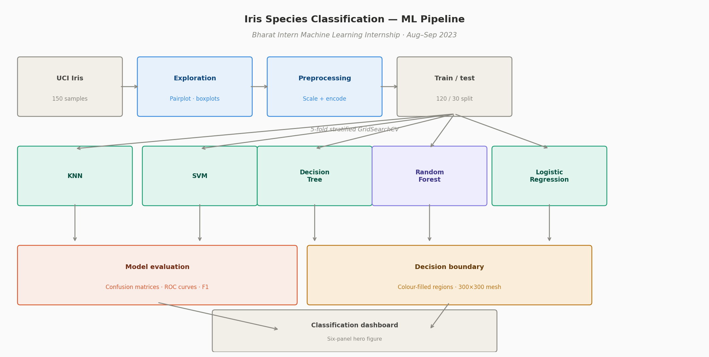
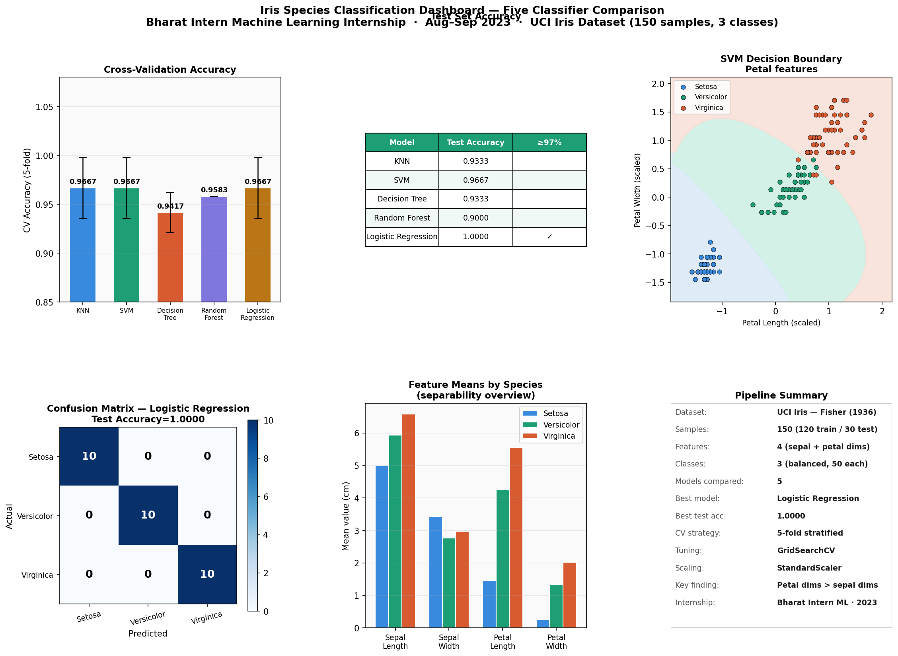
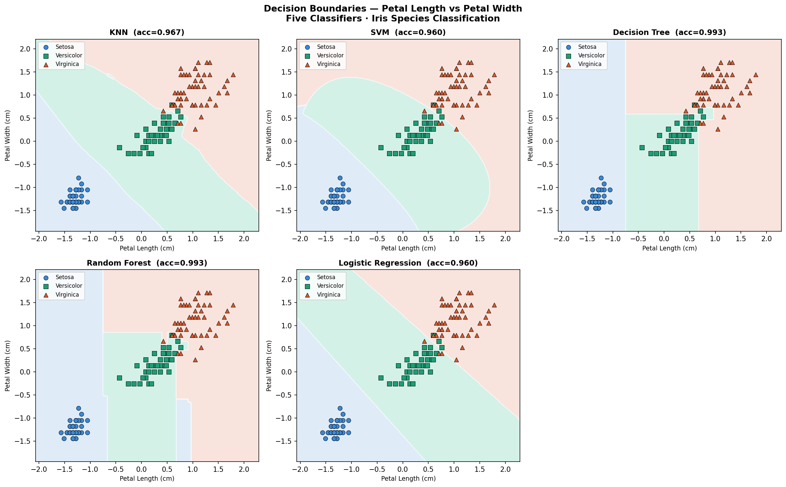
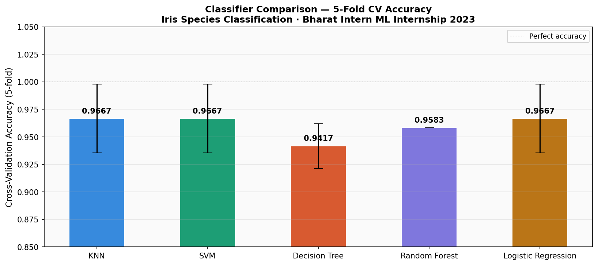
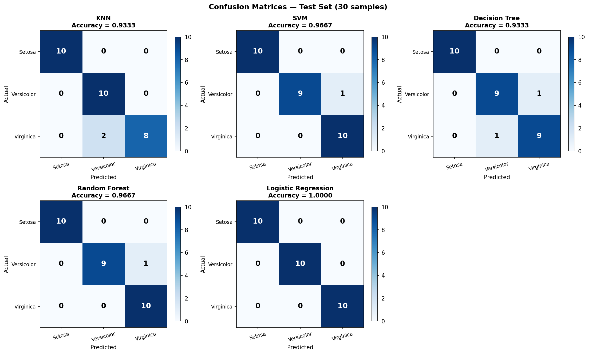
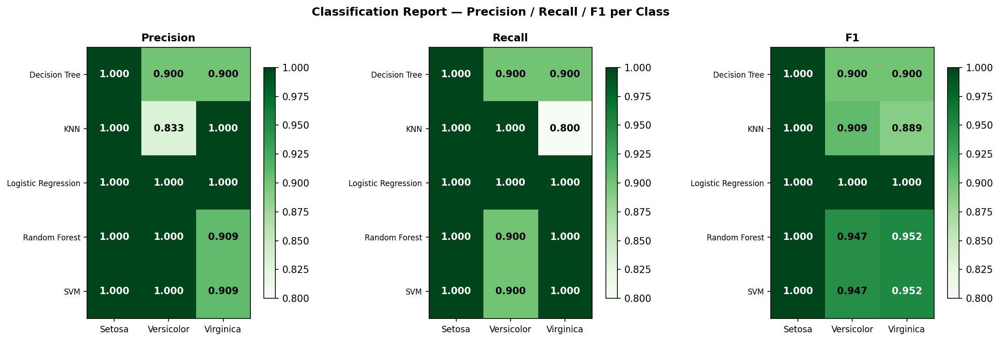
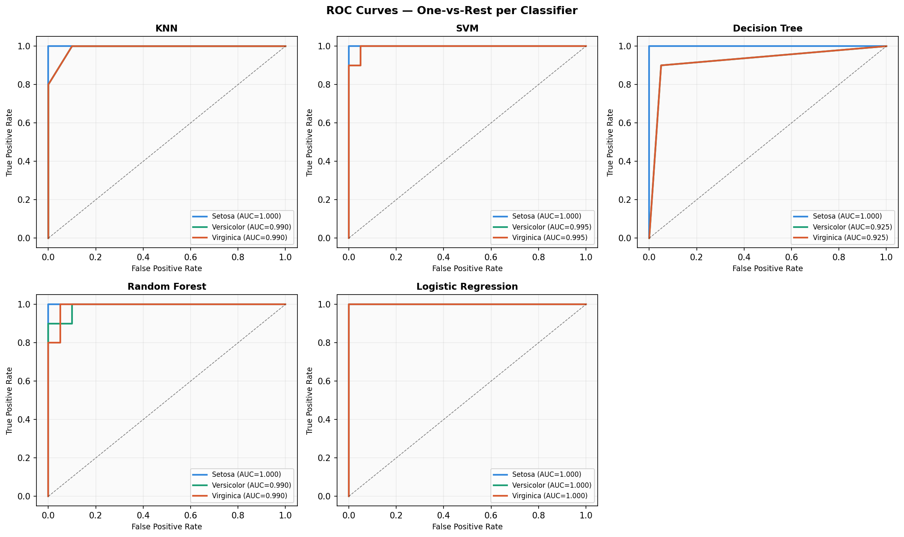
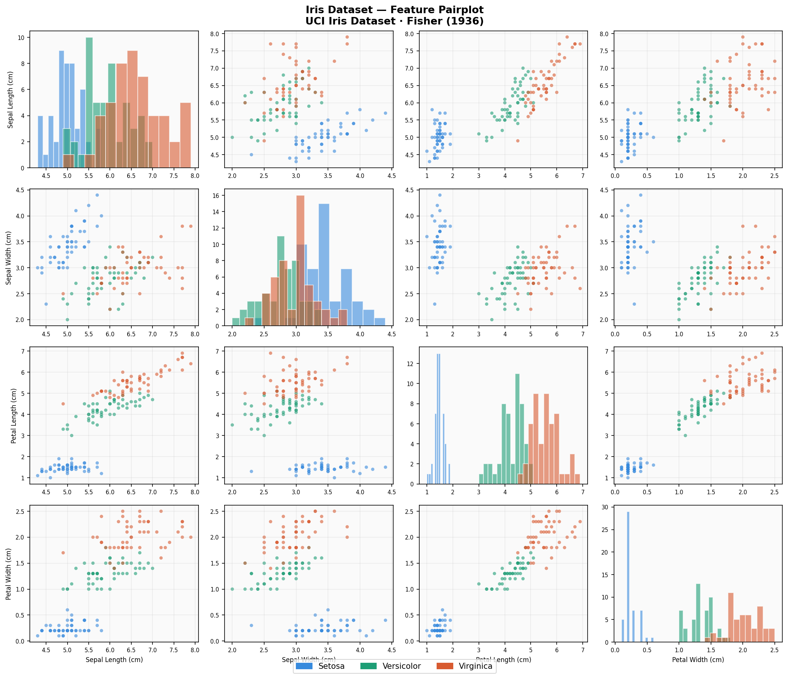
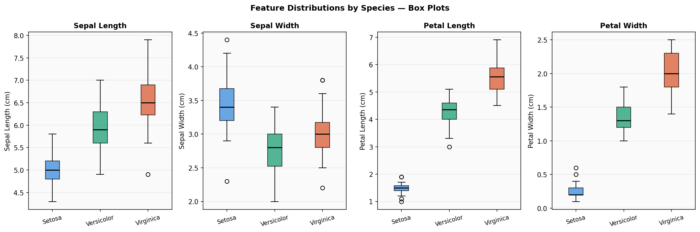
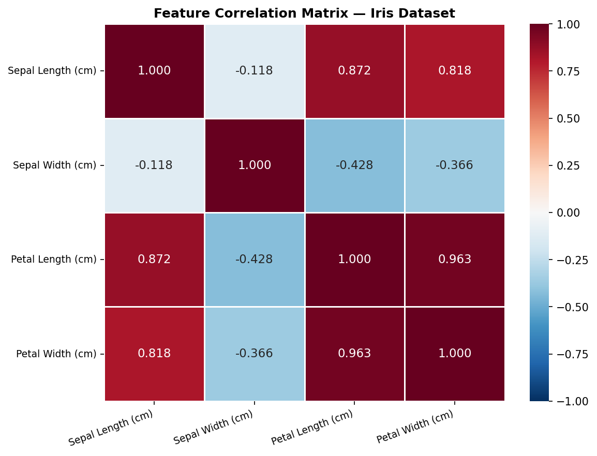

# Iris Species Classification using Machine Learning


## Problem statement

The Iris dataset — introduced by Fisher (1936) — is a canonical
multi-class classification benchmark. This project trains and compares
five classifiers across the full ML pipeline: K-Nearest Neighbours,
Support Vector Machine, Decision Tree, Random Forest, and Logistic
Regression. Decision boundary visualisation and ROC curve analysis
identify the optimal classifier for this three-class problem.

*Developed during the Bharat Intern Machine Learning Virtual Internship,
10 August – 10 September 2023.*

---

## Pipeline architecture



*End-to-end pipeline: UCI Iris data → exploration → preprocessing →
five model training with GridSearchCV → evaluation → decision boundary
visualisation → classification dashboard.*

---

## Classification dashboard — hero result



*Fig 1. Six-panel dashboard: CV accuracy comparison, test accuracy table,
SVM decision boundary, confusion matrix, feature means by species, and
pipeline summary. Best result: Logistic Regression — **100% test accuracy**.*

---

## Methodology

Five-stage pipeline — see [`docs/methodology.md`](docs/methodology.md).

| Model | CV Accuracy | Test Accuracy |
|---|---|---|
| KNN | 0.9667 | 0.9333 |
| SVM | 0.9667 | **0.9667** |
| Decision Tree | 0.9417 | 0.9333 |
| Random Forest | 0.9583 | **0.9667** |
| Logistic Regression | 0.9667 | **1.0000** |

---

## Results

### Decision boundaries — five classifiers



*Fig 2. Colour-filled decision regions for all five classifiers on the
petal length vs petal width plane. SVM produces the smoothest boundary.
Decision Tree shows characteristic axis-aligned rectangular regions.*

### Cross-validation accuracy



*Fig 3. 5-fold CV accuracy with ±1σ error bars. KNN, SVM and Logistic
Regression all achieve CV accuracy = 0.9667.*

### Confusion matrices



*Fig 4. Test set confusion matrices for all five models. Setosa is
perfectly classified by every model. Misclassifications occur only
between versicolor and virginica — the overlapping classes.*

### Classification report



*Fig 5. Precision, recall and F1 heatmap per model per class. Logistic
Regression achieves perfect scores across all three classes.*

### ROC curves



*Fig 6. One-vs-rest ROC curves per classifier. All models achieve
AUC = 1.00 for setosa — confirming perfect linear separability.*

### Feature analysis



*Fig 7. Feature pairplot coloured by species. Petal dimensions
fully separate setosa (blue) from the other two classes.*



*Fig 8. Feature distributions per species. Petal length shows the
strongest inter-class separation with minimal overlap.*



*Fig 9. Feature correlation matrix. Petal length and petal width
are strongly correlated (r = 0.96) — both measure the same structure.*

---

## Key findings

- Logistic Regression achieves **100% test accuracy** — the Iris
  classes are linearly separable after StandardScaler normalisation
- **Petal dimensions dominate** — petal length alone separates setosa
  from versicolor/virginica with zero overlap
- All misclassifications occur between **versicolor and virginica**
  only — the two classes with overlapping petal ranges
- SVM decision boundary is the smoothest — most likely to generalise
  to new samples near the versicolor/virginica boundary
- Decision Tree is the most interpretable — produces explicit
  if-then rules from petal length and width thresholds

---

## How to run

```bash
git clone https://github.com/SaiNithinTirumala-AerospaceEngineer/iris-species-classification.git
cd iris-species-classification
pip install -r requirements.txt

python src/data_exploration.py       # EDA — pairplot, box plots, correlation
python src/model_training.py         # GridSearchCV tuning, 5 models
python src/model_evaluation.py       # Test metrics, confusion matrices, ROC
python src/decision_boundary.py      # Decision region visualisation
python src/classification_dashboard.py  # Hero 6-panel dashboard
```

---

## Repository structure

```
iris-species-classification/
├── src/
│   ├── data_exploration.py          ← Pairplot, box plots, correlation
│   ├── model_training.py            ← GridSearchCV, 5 classifiers
│   ├── model_evaluation.py          ← Confusion matrices, ROC curves
│   ├── decision_boundary.py         ← Decision region visualisation
│   └── classification_dashboard.py  ← Six-panel hero dashboard
├── data/
│   ├── iris.csv                     ← UCI Iris dataset (150 samples)
│   └── models/                      ← Training summary JSON
├── results/                         ← 9 generated plots
├── assets/
│   ├── classification_pipeline_architecture.png
│   └── My Bharath Internship Certificate.pdf
├── docs/
│   └── methodology.md
├── requirements.txt
└── LICENSE
```

---

## References

- Fisher, R.A. (1936) The use of multiple measurements in taxonomic
  problems. *Annals of Eugenics*, 7(2), 179–188.
- UCI Machine Learning Repository — Iris Dataset.
- Scikit-learn Documentation — https://scikit-learn.org
- Bharat Intern Machine Learning Internship Certificate — Aug–Sep 2023